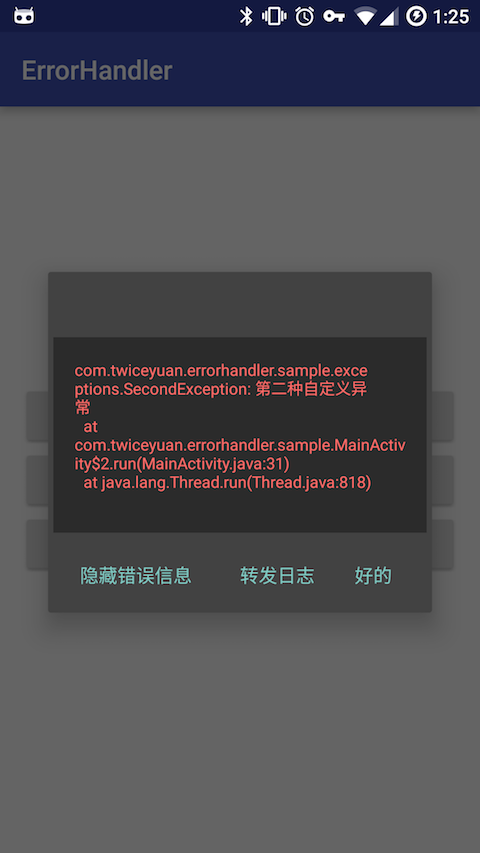

# ErrorHandler

[](https://jitpack.io/#twiceyuan/ErrorHandler)

[](./)

Android 全局异常处理，通过封装 Thread.UncaughtExceptionHandler 实现。通过方便的设定即可在全局对统一的异常做处理，并可以方便拦截主线程异常（FC），定制自己的 FC 界面。

## 使用

初始化

```java
ErrorHandler.init(this);
```

非主线程的异常处理（不会造成 FC 的异常），例如网络中断，服务端返回错误的自定义异常封装

```java
ErrorHandler.addHandler(FirstException.class, exception -> {
    Toast.makeText(App.getApplication(), exception.getMessage(), Toast.LENGTH_SHORT).show();
});
```

项目里默认提供了一个 ReportActivity 来接收主线程的异常信息。用户可以通过下面这个方法来设置自己的 FcHandlerActivity：

```java
void setMainThreadHandler(Class<Activity> activityClass);
```

然后在这个 Activity 中，可以通过`ErrorHandler.getThrowable(this)` 来获得 Throwable 对象，对其做自定义的处理。

## 截图

 

# License
```
Copyright 2016 twiceYuan.

Licensed under the Apache License, Version 2.0 (the "License");
you may not use this file except in compliance with the License.
You may obtain a copy of the License at

   http://www.apache.org/licenses/LICENSE-2.0

Unless required by applicable law or agreed to in writing, software
distributed under the License is distributed on an "AS IS" BASIS,
WITHOUT WARRANTIES OR CONDITIONS OF ANY KIND, either express or implied.
See the License for the specific language governing permissions and
limitations under the License.
```
